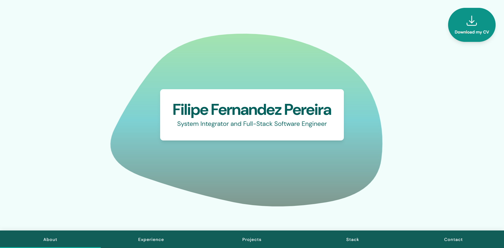

# Portfolio

[](https://reactjs.org/)
[](https://tailwindcss.com/)
[](https://vite.dev/)

A responsive personal portfolio website built with React, Vite, and Tailwind CSS.

https://ffpereira.com/

 

The site presents a single-page portfolio with anchored sections for:

- About
- Experience
- Projects
- Stack
- Contact


## Tech Stack

- React 19.2
- Tailwind CSS 4.1
- Vite 7.2

## Project Structure

```
src/
├── components/   # Reusable UI components
├── tabs/         # Main portfolio sections
├── App.jsx       # Page composition
└── index.css     # Global styles

public/
└── assets/       # Images and other static files
```

## Contact

For questions or feedback, you can reach me at: [me@ffpereira.com](mailto:me@ffpereira.com)